# Olá! Eu sou Rafael!

  
  

💻 Estudante de Desenvolvimento de Sistemas  
🎓 Colégio SESI da Indústria + SENAI PR  
🚀 Interessado em Tecnologia da Informação e programação

---

## 🧑‍💻 Sobre mim

Sou estudante de Desenvolvimento de Sistemas no SENAI PR e do Ensino Médio no Colégio SESI da Indústria.

Tenho interesse em programação, desenvolvimento de software e Tecnologia da Informação. Atualmente estou estudando diferentes linguagens e criando projetos para colocar meus conhecimentos em prática.

---

## 🛠️ Tecnologias

---

## 📚 Atualmente estudando

- 🌐 HTML
- 🎨 CSS
- ⚡ JavaScript
- 🐍 Python
- 💻 C++

---

## 🚀 Projetos

Tenho desenvolvido projetos durante minha formação em Desenvolvimento de Sistemas, praticando lógica de programação, desenvolvimento web e criação de aplicações.

Confira meus projetos nos repositórios do GitHub.

---

## 🎯 Objetivo

Busco uma oportunidade na área de Tecnologia da Informação, onde possa desenvolver meus conhecimentos, aprender com novos desafios e contribuir para a equipe.

---

## 📫 Contato

📧 **E-mail:** rafael.jose.de.souza2010@gmail.com

💼 **LinkedIn:** [Meu LinkedIn](http://linkedin.com/in/rafael-jose1)

---

⭐ Obrigado por visitar meu perfil!
